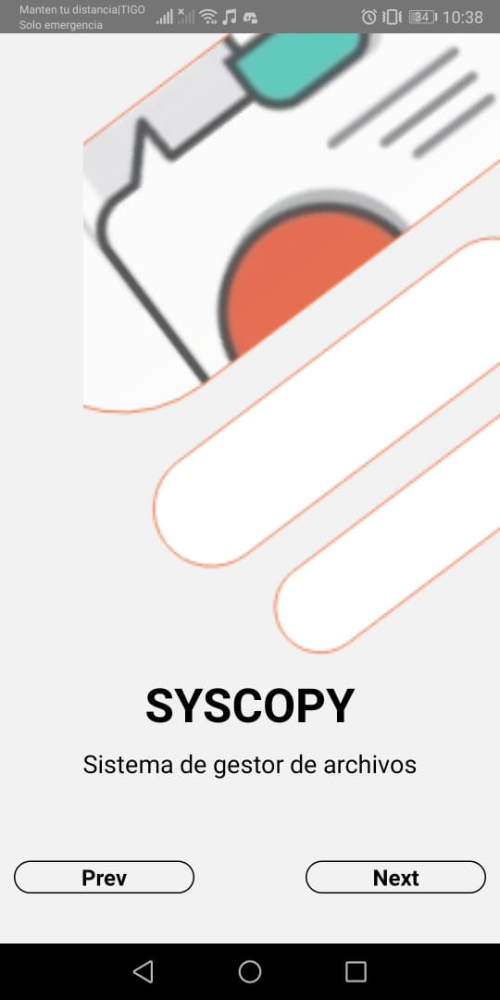

# Proyecto Integrador: Sistema de gestor de archivos

### Definición

El siguiente consistirá en el desarrollo de un proyecto que
permita el usuario ingresar archivos usando como base la tecnología de React Native y Firebase, todo ello haciendo uso de las buenas practicas de la programación.

## Librerias usadas

Para el desarrollo del proyecto necesitamos tener intaladas las
siguientes librerias:
```
  "@react-native-community/masked-view": "^0.1.10",
    "@react-navigation/drawer": "^5.8.1",
    "@react-navigation/native": "^5.5.0",
    "@react-navigation/stack": "^5.4.1",
    "add": "^2.0.6",
    "base-64": "^0.1.0",
    "firebase": "^7.14.6",
    "react": "^16.13.1",
    "react-native": "^0.62.2",
    "react-native-dotenv": "^0.2.0",
    "react-native-gesture-handler": "^1.6.1",
    "react-native-reanimated": "^1.9.0",
    "react-native-safe-area-context": "^0.7.3",
    "react-native-screens": "^2.8.0"
```
## Desarrollo del proyecto

Para realizar el proyecto se implementarón lo siguente:
```
-Onboarding
-Login Screen
-Main Navigaitor
-Firestore
```

## Manual de usuario

### Onboarding

El onboarding funciona mediante react-navigation el cual realizará el
desplazamiento de las distintas páginas que tengamos implementados en el 
proyecto, hasta llegar a la página de LoginScreen.

En el transcurso del Onboarding se dará a conocer algunos textos
a considerar importantes, estós textos se pueden modificar alterando
el código para obtener en las páginas otro texto.
```
Entonces explicado lo anterior pasamos a mostrar las capturas obtenidas:
```
 

 

 

### Login Screen

El loginScreen funciona mediante la autentificacion que ofrece firebase
de una cuenta creada anteriormente para realizar la interacción con la base
de datos. Tambien tiene la acción de registrar un email en caso de no tenerlo
la cual esta situada debajo del boton LOG IN. Este genera 2 cajas de texto
en los cuales se deben registrar un nuevo Email y una contraseña que se almacenara en la base de datos y autenticación de FireBase.
```
Entonces explicado lo anterior pasamos a mostrar las capturas obtenidas:
```


 

### Main Navigator

El MainNavigator funciona mediante react-navigation en está parte estan 
implementadas las paginas creadas mediante el StackNavigator en esta parte
se crea el orden de lás paginas en el momento que se va a iniciar el proyecto.

Tambien cuenta con la función DrawerScreen el cual genera un menu deslizable en la página de AppScreen en el cual tenemos las distintas acciones de :
```
-Crear Docente
-Crear Estudiante
-Crear Jefe de Carrera
-Crear Prueba
```
La siguiente imagen enseña el drawer con lo anterior mencionado:


 
 


### Creación de docente, estudiante, jefe de Carrera

Lo mencionado esta implementado en la parte de DrawerScreen ya anteriormente mencionado, cada uno de estos textos nos redirige una pantalla en la cual cada una de ellas tienen un formulario de registro el cual consta de :
```
-Nombre
-Código
-Correo Electrónico
-Contraseña
-Apellido Paterno
-Apellido Materno

```
Entonces tenemos como captura la siguiente:

 

Una vez ingresado los datos estos pasan a ser registrados en la base de datos que 
ofrece FireBase, esto ocurre gracias a FireStore el cual permite el registro de 
collections y Documents en los cuales se van ingresando los distintos usuarios registrados en las páginas de creación de personal.
```
Entonces tenemos como captura la creación de usuarios en FireBase:
```


 


## Version

0.1.0

## Autor

* **Jose Luis Rodriguez Peredo**

## Proyecto 

[1998joseluis1998](https://github.com/1998joseluis1998/PDM)


